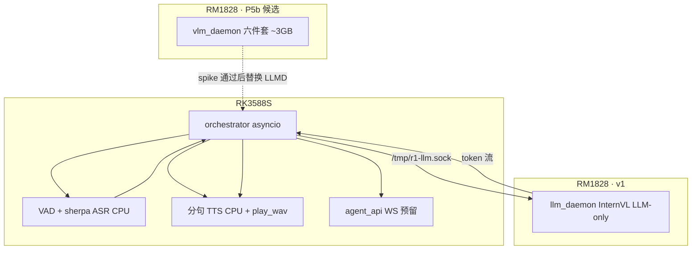

# P5 智能体架构

> **状态：** ✅ v1.0 已锁定 · 2026-08-26  
> **实施细则：** 见 [`TECH_PLAN.md`](TECH_PLAN.md)（含常驻模型四件套路径与参数）

---

## 1. 目标

端侧 **Ollama 式** 智能体：1828 后台常驻大模型，3588 负责语音 I/O 与编排。

- **v1**：InternVL3.5-4B **LLM-only** 流式 chat · 2–4s 首响
- **P5b**：spike 通过后统一 `vlm_daemon`（chat + see 合一）；否则按需 VLM

---

## 2. 常驻模型（一句话）

**InternVL3.5-4B · RKNN3 · llm 四件套 · ~236MB · 不加载 vision**

详见 TECH_PLAN §1。

---

## 3. 架构图

---

## 4. 分阶段

| 阶段 | 内容 |
|------|------|
| A | llm_daemon · InternVL3.5-4B LLM-only 常驻 |
| B | VAD 始终监听 |
| C | sherpa online ASR |
| D | 分句 TTS 队列 |
| E | agent.yaml + agent_api 占位 |
| S | VLM 统一常驻 spike（并行） |
| P5b | see() 或 vlm_daemon（spike 定案） |

---

## 5. 关键决策（已锁定）

| ID | 选定 |
|----|------|
| D1 | v1 chat only · see P5b |
| D2 | 始终监听 + VAD |
| D3 | ASR 3588 CPU sherpa |
| D4 | Python asyncio + C++ daemon |
| D5 | InternVL3.5-4B LLM-only 四件套 |
| D6 | v1 LLM daemon → spike → 统一 vlm_daemon |
| D7 | HDMI 触屏 WS 预留 |

---

## 6. 参考项目

- [sherpa-onnx](https://github.com/k2-fsa/sherpa-onnx) — VAD / streaming ASR / TTS（CPU）
- [voiceapi](https://github.com/ruzhila/voiceapi) — FastAPI 语音 API 参考
- `voice/src/rknn3_session_test.cpp` — llm_daemon fork 基线

---

## 7. 不复用

| 组件 | 处理 |
|------|------|
| `llm_ask.py` | 废弃 |
| `voice_chat.sh` | 废弃 → orchestrator |
| `voice_hw_board.sh` / `play_wav.sh` | 复用 |
